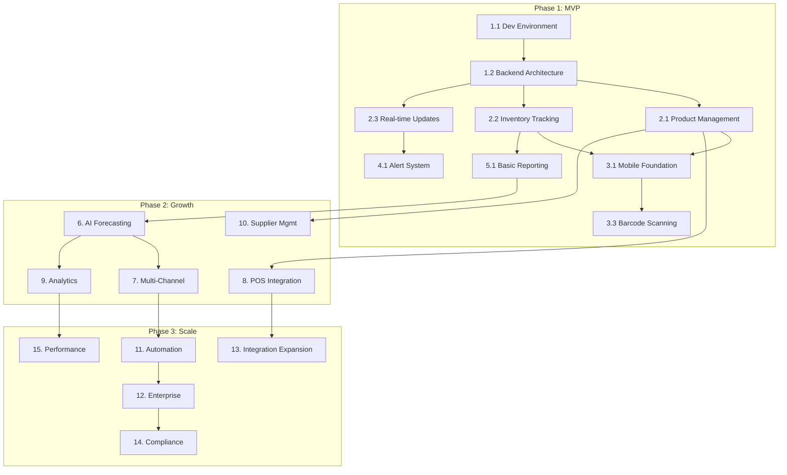

# StokCerdas Development Master Plan

**Version 1.0 | June 2025**

---

## Progress Dashboard

### Overall Progress: 5% Complete

| Phase | Status | Progress | Target Date | Actual Date |
|-------|--------|----------|-------------|-------------|
| Phase 1: MVP | 🟡 In Progress | 10% | Month 3 | Started 2025-06-29 |
| Phase 2: Growth | 🔴 Not Started | 0% | Month 6 | - |
| Phase 3: Scale | 🔴 Not Started | 0% | Month 12 | - |

### Current Sprint: Week 1
**Focus Area**: Technical Foundation Setup  
**Blockers**: None  
**Next Checkpoint**: Week 2 Review  
**Status**: ✅ Development Environment Complete - Ready for Backend Architecture

### Status Legend
- 🔴 Not Started (0%)
- 🟡 In Progress (1-99%)
- 🟢 Completed (100%)
- ⏸️ On Hold
- ❌ Blocked
- ⬜ Task Pending
- ✅ Task Completed
- 🔄 Task In Progress
- ⚠️ At Risk
- 📅 Scheduled

---

## Task Dependencies & Critical Path

### Dependency Visualization



### Critical Path (Minimum Time to Launch)
1. **Week 1-2**: Development Environment → Backend Architecture
2. **Week 3-4**: Core Backend Features (Products, Inventory)
3. **Week 5-6**: Mobile App Foundation
4. **Week 7-8**: Barcode Scanning & Real-time Updates
5. **Week 9-10**: Alert System & Basic Testing
6. **Week 11-12**: MVP Deployment & Beta Launch

**Total Critical Path Duration**: 12 weeks for MVP

### Parallel Work Streams
- **Stream 1**: Backend Development (Weeks 1-6)
- **Stream 2**: Mobile Development (Weeks 5-10)
- **Stream 3**: DevOps & Infrastructure (Weeks 1-12)
- **Stream 4**: Testing & Documentation (Weeks 8-12)

---

## Resource Allocation Plan

### Team Structure & Allocation

| Role | Phase 1 (MVP) | Phase 2 (Growth) | Phase 3 (Scale) |
|------|---------------|------------------|-----------------|
| Backend Engineers | 2 FTE | 3 FTE | 4 FTE |
| Mobile Developers | 1 FTE | 2 FTE | 2 FTE |
| ML Engineers | - | 2 FTE | 2 FTE |
| DevOps Engineers | 1 FTE | 1 FTE | 2 FTE |
| QA Engineers | 1 FTE | 2 FTE | 3 FTE |
| UI/UX Designers | 1 FTE | 1 FTE | 1 FTE |
| Product Manager | 1 FTE | 1 FTE | 1 FTE |
| **Total Team Size** | **7 FTE** | **12 FTE** | **15 FTE** |

### Budget Allocation (Monthly)

| Category | Phase 1 | Phase 2 | Phase 3 |
|----------|---------|---------|---------|
| Personnel | $70,000 | $120,000 | $150,000 |
| Infrastructure | $5,000 | $10,000 | $20,000 |
| Third-party Services | $3,000 | $8,000 | $15,000 |
| Marketing | $2,000 | $10,000 | $25,000 |
| **Total Monthly** | **$80,000** | **$148,000** | **$210,000** |

### Key Milestones & Deliverables

| Milestone | Date | Deliverable | Success Criteria |
|-----------|------|-------------|------------------|
| M1: Dev Environment | Week 2 | Complete dev setup | All developers productive |
| M2: Core Backend | Week 6 | API v1 ready | All endpoints functional |
| M3: Mobile MVP | Week 10 | App beta release | Core features working |
| M4: Beta Launch | Week 12 | 50 beta users | <5% critical bugs |
| M5: AI Features | Month 5 | Forecasting live | >85% accuracy |
| M6: Growth Launch | Month 6 | Public release | 1,000 users |
| M7: Enterprise Ready | Month 9 | Enterprise features | 5 enterprise clients |
| M8: Scale Achievement | Month 12 | Platform maturity | 10,000 users |

---

## Executive Summary

This master plan outlines the complete development roadmap for StokCerdas, an AI-powered inventory intelligence SaaS platform for Indonesian SMBs. The plan is divided into three major phases spanning 12 months, with detailed tasks, subtasks, and checkpoints for tracking progress.

### Key Principles
- **Mobile-First Development**: 85% of Indonesian SMBs use smartphones
- **Security by Design**: SOC 2 Type II compliance from the start
- **Local-First Approach**: Indonesian language, payment methods, and cultural considerations
- **Scalability Focus**: Multi-tenant architecture supporting 10,000+ concurrent users
- **Integration Ready**: Built for seamless connection with Indonesian business tools

---

## Phase 1: MVP Development (Months 1-3)

### Phase 1 Progress Tracker

| Week | Checkpoint | Target Completion | Status | Notes |
|------|------------|-------------------|--------|-------|
| W1-2 | Development Environment Ready | 10% | 🟢 | Git, Docker, CI/CD ✅ |
| W3-4 | Backend Architecture Complete | 25% | 🔴 | Multi-tenant, API structure |
| W5-6 | Core Features Backend Ready | 40% | 🔴 | Products, Inventory, Auth |
| W7-8 | Mobile App Foundation | 55% | 🔴 | React Native, Offline sync |
| W9-10 | Barcode & Alerts Working | 70% | 🔴 | Scanning, Notifications |
| W11-12 | MVP Testing & Deployment | 100% | 🔴 | Beta launch ready |

### 1. Technical Foundation Setup 🔄 
**Progress**: 60% | **Status**: 🟡 In Progress | **Dependencies**: None  
**Planned**: Week 1-2 | **Start Date**: 2025-06-29 | **End Date**: - | **Owner**: DevOps Team

#### 1.1 Development Environment ✅
- [x] Setup Git repository structure with Github ✅ (2025-06-29)
- [x] Configure Docker Compose for local development ✅ (2025-06-29)
  - [x] PostgreSQL with proper configuration ✅ (2025-06-29)
  - [x] Redis for caching ✅ (2025-06-29)
  - [x] MinIO for S3-compatible storage ✅ (2025-06-29)
  - [x] RabbitMQ for message queuing ✅ (2025-06-29)
  - [x] Elasticsearch single node ✅ (2025-06-29)
- [x] Setup development, staging, and production environments ✅ (2025-06-29)
- [x] Configure CI/CD pipeline with Github CI ✅ (2025-06-29)
- [x] Implement infrastructure as code with Terraform ✅ (2025-06-29)

#### 1.2 Backend Architecture ⬜
- [ ] Initialize Node.js project with NestJS framework
- [ ] Implement multi-tenant architecture
  - [ ] Row-level security with tenant_id
  - [ ] Tenant isolation middleware
  - [ ] Shared infrastructure configuration
- [ ] Setup database schema
  - [ ] Products table with multi-tenant support
  - [ ] Inventory locations table
  - [ ] Inventory transactions audit table
  - [ ] Users and permissions tables
- [ ] Configure API structure
  - [ ] RESTful API design
  - [ ] API versioning (v1)
  - [ ] Response format standardization
  - [ ] Error handling middleware

#### 1.3 Security Foundation ⬜
- [ ] Implement authentication system
  - [ ] JWT token generation and validation
  - [ ] Refresh token mechanism
  - [ ] Multi-factor authentication (MFA)
- [ ] Setup authorization with RBAC
  - [ ] Define roles (Admin, Manager, Staff)
  - [ ] Permission matrix implementation
  - [ ] API endpoint protection
- [ ] Configure security headers
  - [ ] CORS configuration
  - [ ] Helmet.js integration
  - [ ] Rate limiting
  - [ ] Input validation and sanitization

### 2. Core Backend Features ⬜
**Progress**: 0% | **Status**: 🔴 Not Started | **Dependencies**: Task 1.2 (Backend Architecture)  
**Planned**: Week 3-6 | **Start Date**: - | **End Date**: - | **Owner**: Backend Team

#### 2.1 Product Management Module ⬜
- [ ] CRUD operations for products
  - [ ] Create product with SKU validation
  - [ ] Update product information
  - [ ] Soft delete functionality
  - [ ] Bulk import/export
- [ ] Category management
- [ ] Product variants support
- [ ] Barcode generation and mapping

#### 2.2 Inventory Tracking System ⬜
- [ ] Real-time inventory levels
  - [ ] Quantity on hand tracking
  - [ ] Reserved quantity management
  - [ ] Available quantity calculation
- [ ] Multi-location support
  - [ ] Location hierarchy (warehouse, store, bin)
  - [ ] Inter-location transfers
  - [ ] Location-specific pricing
- [ ] Inventory movements
  - [ ] Stock adjustments
  - [ ] Reason codes
  - [ ] Audit trail with user tracking

#### 2.3 Real-time Updates ⬜
- [ ] WebSocket implementation with Socket.io
  - [ ] Connection management
  - [ ] Room-based updates (per tenant)
  - [ ] Reconnection handling
- [ ] Event broadcasting system
  - [ ] Inventory change events
  - [ ] Alert notifications
  - [ ] System status updates
- [ ] Optimistic UI support
  - [ ] Conflict resolution
  - [ ] Eventual consistency

### 3. Mobile Application Development ⬜
**Progress**: 0% | **Status**: 🔴 Not Started | **Dependencies**: Task 2.1, 2.2 (Core Backend Features)  
**Planned**: Week 5-10 | **Start Date**: - | **End Date**: - | **Owner**: Mobile Team

#### 3.1 Mobile App Foundation ⬜
- [ ] React Native project setup
- [ ] Navigation structure implementation
  - [ ] Bottom navigation for mobile
  - [ ] Stack navigation for screens
- [ ] State management with Redux/Context
- [ ] Offline-first architecture
  - [ ] Local database (SQLite/Realm)
  - [ ] Sync queue implementation
  - [ ] Conflict resolution

#### 3.2 Core Mobile Features ⬜
- [ ] Authentication flow
  - [ ] Login/logout
  - [ ] Biometric authentication
  - [ ] Remember me functionality
- [ ] Dashboard implementation
  - [ ] Key metrics display
  - [ ] Quick actions
  - [ ] Recent activities
- [ ] Inventory management screens
  - [ ] Product listing with search
  - [ ] Product details view
  - [ ] Stock adjustment interface

#### 3.3 Barcode Scanning ⬜
- [ ] Camera permission handling
- [ ] Barcode scanner integration
  - [ ] Multiple format support
  - [ ] Fast recognition (<2 seconds)
  - [ ] Manual entry fallback
- [ ] Scan workflow
  - [ ] Product lookup
  - [ ] Quantity adjustment
  - [ ] Batch scanning mode

### 4. Alert System ⬜
**Progress**: 0% | **Status**: 🔴 Not Started | **Dependencies**: Task 2.3 (Real-time Updates)  
**Planned**: Week 8-9 | **Start Date**: - | **End Date**: - | **Owner**: Backend Team

#### 4.1 Notification Infrastructure ⬜
- [ ] Push notification setup
  - [ ] FCM integration
  - [ ] Device token management
  - [ ] Topic subscriptions
- [ ] In-app notification center
- [ ] Email notification system
- [ ] SMS integration (optional)

#### 4.2 Alert Types Implementation ⬜
- [ ] Low stock alerts
  - [ ] Reorder point configuration
  - [ ] Alert triggering logic
  - [ ] Snooze functionality
- [ ] Expiry date warnings
- [ ] Order status updates
- [ ] System maintenance notices

### 5. Basic Reporting ⬜
**Progress**: 0% | **Status**: 🔴 Not Started | **Dependencies**: Task 2.2 (Inventory Tracking)  
**Planned**: Week 10-11 | **Start Date**: - | **End Date**: - | **Owner**: Backend Team

#### 5.1 Report Generation ⬜
- [ ] Inventory valuation report
- [ ] Stock movement report
- [ ] Low stock report
- [ ] Product performance report

#### 5.2 Export Functionality ⬜
- [ ] PDF generation
- [ ] Excel export
- [ ] CSV download
- [ ] Email report delivery

---

## Phase 2: Growth Features (Months 4-6)

### Phase 2 Progress Tracker

| Week | Checkpoint | Target Completion | Status | Notes |
|------|------------|-------------------|--------|-------|
| W13-14 | ML Infrastructure Setup | 15% | 🔴 | Model development env |
| W15-16 | AI Forecasting Models Ready | 30% | 🔴 | ARIMA, Prophet, XGBoost |
| W17-18 | E-commerce Integrations | 50% | 🔴 | Tokopedia, Shopee |
| W19-20 | POS Integrations Complete | 65% | 🔴 | Moka, Pawoon |
| W21-22 | Analytics Dashboard Live | 80% | 🔴 | BI tools, predictions |
| W23-24 | Growth Features Testing | 100% | 🔴 | 500+ beta users |

### 6. AI-Powered Demand Forecasting ⬜
**Progress**: 0% | **Status**: 🔴 Not Started | **Dependencies**: Phase 1 completion, 3 months historical data

#### 6.1 Machine Learning Infrastructure ⬜
- [ ] ML model development environment
- [ ] Data pipeline for training
  - [ ] Historical sales data collection
  - [ ] External factors integration
  - [ ] Data preprocessing
- [ ] Model training pipeline
  - [ ] ARIMA implementation
  - [ ] Prophet integration
  - [ ] XGBoost for ensemble
- [ ] Model serving infrastructure

#### 6.2 Forecasting Features ⬜
- [ ] Demand prediction interface
  - [ ] 30/60/90 day forecasts
  - [ ] Confidence intervals
  - [ ] Seasonality visualization
- [ ] New product forecasting
  - [ ] Category-based predictions
  - [ ] Similar product analysis
- [ ] Forecast accuracy tracking
  - [ ] MAPE calculation
  - [ ] Bias detection
  - [ ] Model retraining triggers

### 7. Multi-Channel Integration ⬜
**Progress**: 0% | **Status**: 🔴 Not Started | **Dependencies**: Task 6 (AI Forecasting), stable API

#### 7.1 E-commerce Integrations ⬜
- [ ] Tokopedia integration
  - [ ] OAuth authentication
  - [ ] Product sync
  - [ ] Order fulfillment
  - [ ] Inventory updates
- [ ] Shopee integration
  - [ ] API authentication
  - [ ] Catalog management
  - [ ] Stock synchronization
- [ ] Lazada integration
- [ ] Instagram Shopping setup
- [ ] WhatsApp Business API

#### 7.2 Channel Management ⬜
- [ ] Unified inventory pool
  - [ ] Channel allocation rules
  - [ ] Buffer stock configuration
  - [ ] Priority management
- [ ] Order routing
  - [ ] Multi-channel orders view
  - [ ] Fulfillment optimization
  - [ ] Shipping integration

### 8. POS System Integration ⬜
**Progress**: 0% | **Status**: 🔴 Not Started | **Dependencies**: Task 2.1 (Product Management)

#### 8.1 Moka POS Integration ⬜
- [ ] API authentication setup
- [ ] Product catalog sync
- [ ] Sales data import
- [ ] Inventory deduction

#### 8.2 Pawoon Integration ⬜
- [ ] Connection setup
- [ ] Menu mapping
- [ ] Transaction sync
- [ ] Offline handling

### 9. Advanced Analytics ⬜
**Progress**: 0% | **Status**: 🔴 Not Started | **Dependencies**: Task 6 (AI Models), 6 months data

#### 9.1 Business Intelligence ⬜
- [ ] Analytics dashboard
  - [ ] Revenue analytics
  - [ ] Inventory turnover
  - [ ] Product performance
  - [ ] Customer insights
- [ ] Custom metrics builder
- [ ] Benchmarking tools

#### 9.2 Predictive Analytics ⬜
- [ ] Stockout prediction
- [ ] Slow-moving item detection
- [ ] Optimal reorder suggestions
- [ ] Price optimization hints

### 10. Supplier Management ⬜
**Progress**: 0% | **Status**: 🔴 Not Started | **Dependencies**: Task 2.1 (Product Management)

#### 10.1 Supplier Database ⬜
- [ ] Supplier profile management
- [ ] Contact information
- [ ] Payment terms
- [ ] Performance history

#### 10.2 Purchase Order System ⬜
- [ ] PO creation workflow
- [ ] Approval process
- [ ] Email/PDF generation
- [ ] Order tracking

---

## Phase 3: Scale & Enhancement (Months 7-12)

### Phase 3 Progress Tracker

| Week | Checkpoint | Target Completion | Status | Notes |
|------|------------|-------------------|--------|-------|
| W25-28 | Automation Engine Built | 20% | 🔴 | Rules, workflows |
| W29-32 | Enterprise Features Ready | 40% | 🔴 | Multi-entity, permissions |
| W33-36 | Major Integrations Done | 60% | 🔴 | Accounting, logistics |
| W37-40 | SOC 2 Audit Preparation | 75% | 🔴 | Controls, documentation |
| W41-44 | Performance Optimization | 90% | 🔴 | Microservices, scaling |
| W45-48 | Final Testing & Launch | 100% | 🔴 | 10K customers target |

### 11. Automation Features ⬜
**Progress**: 0% | **Status**: 🔴 Not Started | **Dependencies**: Phase 2 completion, stable API

#### 11.1 Automated Purchasing ⬜
- [ ] Reorder rule engine
  - [ ] EOQ calculation
  - [ ] Lead time consideration
  - [ ] Safety stock optimization
- [ ] Auto-PO generation
  - [ ] Approval workflow
  - [ ] Supplier selection logic
  - [ ] Budget constraints

#### 11.2 Workflow Automation ⬜
- [ ] Custom workflow builder
- [ ] Trigger configuration
- [ ] Action templates
- [ ] Notification rules

### 12. Enterprise Features ⬜
**Progress**: 0% | **Status**: 🔴 Not Started | **Dependencies**: Task 11 (Automation), stable platform

#### 12.1 Advanced Permissions ⬜
- [ ] Hierarchical roles
- [ ] Custom permission sets
- [ ] Department isolation
- [ ] Approval hierarchies

#### 12.2 Multi-Entity Support ⬜
- [ ] Company structure
- [ ] Inter-company transfers
- [ ] Consolidated reporting
- [ ] Separate billing

### 13. Integration Expansion ⬜
**Progress**: 0% | **Status**: 🔴 Not Started | **Dependencies**: Phase 2 integrations

#### 13.1 Accounting Software ⬜
- [ ] QuickBooks integration
  - [ ] Item sync
  - [ ] COGS tracking
  - [ ] Invoice generation
- [ ] Accurate Online integration
  - [ ] Tax compliance
  - [ ] Multi-currency support

#### 13.2 Logistics Integration ⬜
- [ ] JNE integration
- [ ] J&T Express
- [ ] Gojek/Grab instant
- [ ] Tracking updates

### 14. Compliance & Security ⬜
**Progress**: 0% | **Status**: 🔴 Not Started | **Dependencies**: All core features

#### 14.1 SOC 2 Certification ⬜
- [ ] Control implementation
- [ ] Documentation preparation
- [ ] Audit readiness
- [ ] Certification process

#### 14.2 Data Protection ⬜
- [ ] UU PDP compliance
- [ ] Consent management
- [ ] Data retention policies
- [ ] Right to deletion

### 15. Performance Optimization ⬜
**Progress**: 0% | **Status**: 🔴 Not Started | **Dependencies**: Load testing results

#### 15.1 System Optimization ⬜
- [ ] Database indexing
- [ ] Query optimization
- [ ] Caching strategy
- [ ] CDN implementation

#### 15.2 Scalability Improvements ⬜
- [ ] Microservices migration
- [ ] Event-driven architecture
- [ ] Load balancing
- [ ] Auto-scaling setup

---

## Best Practices Implementation

### Technical Best Practices
1. **API Design**
   - RESTful principles with consistent naming
   - Versioning from day one
   - Comprehensive error handling
   - Rate limiting per tenant

2. **Database Design**
   - Multi-tenant isolation
   - Proper indexing strategy
   - Audit trails for compliance
   - Regular backup procedures

3. **Security Implementation**
   - Security-first mindset
   - Regular security audits
   - Encryption at rest and in transit
   - Principle of least privilege

4. **Performance Standards**
   - <200ms API response time (p95)
   - <2 second page load
   - 99.9% uptime SLA
   - Real-time sync <100ms

### Development Process
1. **Code Quality**
   - Minimum 80% test coverage
   - Code review mandatory
   - Linting and formatting
   - Documentation standards

2. **Deployment Process**
   - Blue-green deployments
   - Automated testing
   - Rollback procedures
   - Feature flags

3. **Monitoring**
   - Real-time performance monitoring
   - Error tracking
   - Business metrics dashboard
   - Alert escalation

### Cultural Adaptation
1. **Indonesian Localization**
   - Bahasa Indonesia as primary language
   - Local payment methods (QRIS, e-wallets)
   - Indonesian business practices
   - Local timezone support

2. **Mobile-First Design**
   - Touch-optimized interfaces
   - Offline capability
   - Low bandwidth optimization
   - PWA implementation

---

## Success Checkpoints

### Month 3 Checkpoint
- [ ] MVP deployed to production
- [ ] 50 beta users onboarded
- [ ] Core features operational
- [ ] Mobile apps in app stores

### Month 6 Checkpoint
- [ ] 1,000 active users
- [ ] AI forecasting live
- [ ] 5+ integrations active
- [ ] $20K MRR achieved

### Month 12 Checkpoint
- [ ] 10,000 customers
- [ ] SOC 2 certified
- [ ] 15+ integrations
- [ ] $50K MRR achieved

---

## Risk Mitigation Strategies

1. **Technical Risks**
   - Implement robust testing
   - Maintain staging environment
   - Regular security audits
   - Performance monitoring

2. **Market Risks**
   - Continuous user feedback
   - Agile development approach
   - Competitive analysis
   - Local partnerships

3. **Compliance Risks**
   - Legal consultation
   - Regular compliance reviews
   - Data protection measures
   - Audit trails

---

## Risk Tracking & Mitigation

### Current Risk Register

| Risk ID | Description | Impact | Probability | Status | Mitigation |
|---------|-------------|--------|-------------|--------|------------|
| R001 | Delay in backend architecture | High | Medium | 🟡 Active | Add 1 senior backend dev |
| R002 | ML model accuracy < 85% | Medium | Low | 🟢 Monitoring | Ensemble approach ready |
| R003 | Integration API changes | Medium | High | 🟡 Active | Version locking, fallbacks |
| R004 | Mobile app store rejection | Low | Low | 🟢 Monitoring | Pre-review checklist |
| R005 | GDPR/UU PDP compliance | High | Medium | 🔴 Planning | Legal consultation needed |

### Risk Status:
- 🔴 Planning (mitigation being developed)
- 🟡 Active (mitigation in progress)
- 🟢 Monitoring (risk controlled)
- ⚫ Resolved (risk eliminated)

---

## Sprint Planning & Velocity Tracking

### Current Sprint (Week 1)
**Sprint Goal**: Complete development environment setup  
**Story Points**: 21  
**Team Velocity**: N/A (first sprint)

| Story | Points | Assignee | Status | Notes |
|-------|--------|----------|--------|-------|
| Setup Github repo | 3 | DevOps | 🔴 | Starting Monday |
| Docker Compose config | 5 | Backend | 🔴 | Blocked by repo |
| CI/CD pipeline | 8 | DevOps | 🔴 | Templates ready |
| Dev documentation | 5 | All | 🔴 | Ongoing |

### Velocity History
| Sprint | Planned | Completed | Velocity |
|--------|---------|-----------|----------|
| Week 1 | 21 | - | - |

---

## Detailed Checkpoint Criteria

### Phase 1 Checkpoints

#### CP1.1: Development Environment (Week 2)
- [ ] All developers can clone and run the project locally
- [ ] Docker Compose starts all services with one command
- [ ] CI/CD pipeline runs on every commit
- [ ] Development, staging, production environments accessible
- [ ] Infrastructure as code reviewed and tested

#### CP1.2: Backend Architecture (Week 4)
- [ ] Multi-tenant isolation tested with 5 test tenants
- [ ] API documentation auto-generated and accessible
- [ ] All CRUD operations have >90% test coverage
- [ ] Authentication flow works with JWT tokens
- [ ] Database migrations run smoothly

#### CP1.3: Core Features (Week 6)
- [ ] Product management API handles 1000+ products
- [ ] Inventory tracking accurate to the second
- [ ] Real-time updates work with <100ms latency
- [ ] 10 beta testers successfully use the system

---

## How to Update Progress

### Task Completion Process
1. **Mark individual subtasks**: Check the checkbox when a subtask is complete
   - `[ ]` ➡️ `[x]` for completed tasks
2. **Update section progress**: Calculate percentage based on completed subtasks
3. **Update status indicator**: 
   - 🔴 Not Started (0%)
   - 🟡 In Progress (1-99%)
   - 🟢 Completed (100%)
4. **Update weekly checkpoint table**: Mark milestones as they are achieved
5. **Update Phase Progress Tracker**: Reflect overall phase completion
6. **Update Progress Dashboard**: Update the top-level dashboard weekly
7. **Update Risk Register**: Review and update risk status
8. **Update Sprint Tracking**: Log completed story points

### Example Progress Update
```markdown
### 1. Technical Foundation Setup 🔄 
**Progress**: 45% | **Status**: 🟡 In Progress | **Dependencies**: None
**Start Date**: 2025-06-01 | **End Date**: 2025-06-14 | **Actual End**: -

#### 1.1 Development Environment ✅
- [x] Setup Git repository structure with Github ✅ (2025-06-01)
- [x] Configure Docker Compose for local development ✅ (2025-06-02)
```

### Weekly Review Checklist
- [ ] Update all completed task checkboxes with completion dates
- [ ] Calculate and update section progress percentages
- [ ] Update status indicators (🔴/🟡/🟢)
- [ ] Update weekly checkpoint tables
- [ ] Update Progress Dashboard
- [ ] Review and update Risk Register
- [ ] Calculate sprint velocity
- [ ] Note any blockers or dependencies
- [ ] Adjust timelines if needed
- [ ] Commit changes with descriptive message

## Notes

- All checkboxes (⬜) indicate pending tasks
- Checked boxes (✅) will indicate completed tasks
- Update this document weekly with progress
- Review and adjust timelines monthly
- Maintain version control for all changes

---

## Completion Summary

### Task Completion by Phase

| Phase | Total Tasks | Completed | In Progress | Not Started | % Complete |
|-------|-------------|-----------|-------------|-------------|------------|
| Phase 1 | 65 | 0 | 0 | 65 | 0% |
| Phase 2 | 48 | 0 | 0 | 48 | 0% |
| Phase 3 | 37 | 0 | 0 | 37 | 0% |
| **Total** | **150** | **0** | **0** | **150** | **0%** |

### Checkpoint Achievement

| Checkpoint Type | Total | Achieved | Success Rate |
|-----------------|-------|----------|--------------|
| Weekly Checkpoints | 48 | 0 | 0% |
| Phase Milestones | 3 | 0 | 0% |
| Critical Path Items | 15 | 0 | 0% |

---

## Version History

| Version | Date | Author | Changes |
|---------|------|--------|---------|
| 1.0 | 2025-06-29 | Initial | Created comprehensive master plan with 150 tasks |
| | | | Added progress tracking system |
| | | | Added dependency mapping |
| | | | Added resource allocation |
| | | | Added risk tracking |

---

*Last Updated: June 2025 | Version 1.0*